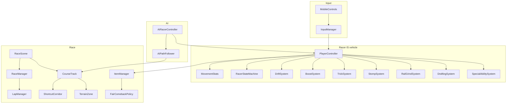

# Wave010 UML — foot-racing mastery deepenings (current)

Notes:
- No Wave010 duplicate controllers.
- ShortcutCorridor is geometry/risk, not checkpoint bypass.
- FairComebackPolicy weights items; never place-based speed in competitive mode.
