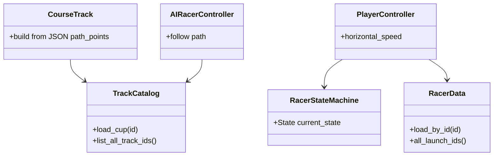

# Class — racer / course (current)

`scripts/data/RacerData.gd`, `TrackCatalog.gd`, `scripts/tracks/CourseTrack.gd`, `scripts/player/PlayerController.gd`, `RacerStateMachine.gd`, `scripts/ai/AIRacerController.gd`.
