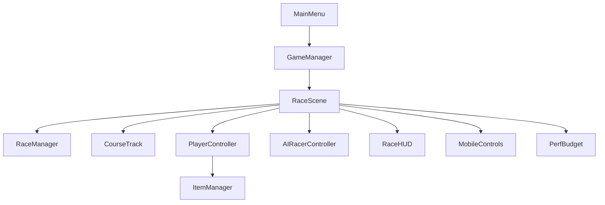

# Component — current

```mermaid
flowchart TB
  MENU[MainMenu]
  GM[GameManager]
  RS[RaceScene]
  RM[RaceManager]
  CT[CourseTrack]
  PC[PlayerController]
  AI[AIRacerController]
  IT[ItemManager]
  HUD[RaceHUD]
  MOB[MobileControls]
  PERF[PerfBudget]
  MENU --> GM
  GM --> RS
  RS --> RM
  RS --> CT
  RS --> PC
  RS --> AI
  PC --> IT
  RS --> HUD
  RS --> MOB
  RS --> PERF
```
