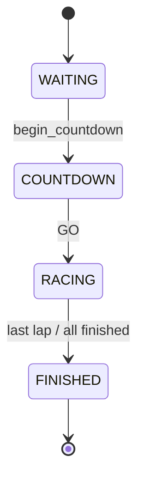

# State machine — race (current)

Racer locomotion SM (separate): GROUNDED / AIR / SLIDE / DRIFT / STOMP in `RacerStateMachine.gd`. Race flow: `RaceManager.RaceState` in `scripts/race/RaceManager.gd`.
