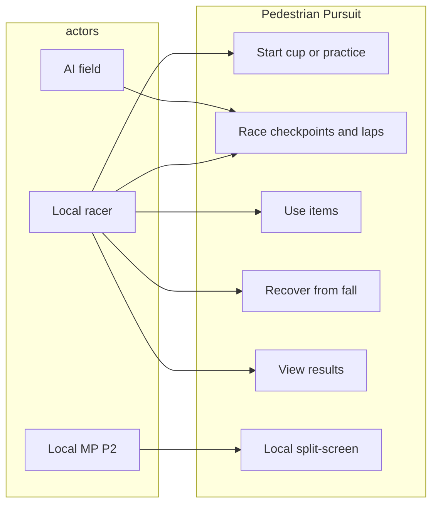

# Use case — current

```mermaid
flowchart LR
  subgraph actors
    P[Local racer]
    AI[AI field]
    P2[Local MP P2]
  end
  subgraph game [Pedestrian Pursuit]
    UC1[Start cup or practice]
    UC2[Race checkpoints and laps]
    UC3[Use items]
    UC4[Recover from fall]
    UC5[View results]
    UC6[Local split-screen]
  end
  P --> UC1
  P --> UC2
  AI --> UC2
  P --> UC3
  P --> UC4
  P --> UC5
  P2 --> UC6
```

Code: `scripts/ui/MainMenu.gd`, `scripts/race/RaceManager.gd`, `scripts/items/ItemManager.gd`, `scripts/race/LocalMPSplitDirector.gd`.
